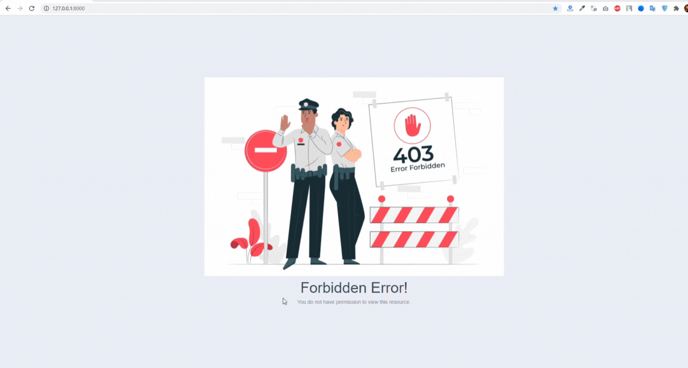

# block-ip-address-laravel
Laravel 8 Project Restrict User Access From IP Addresses. prevent other ip address that want to access over secure api or urls. 

## How to use

1. git clone `git clone https://github.com/hasmukh-dharajiya/block-ip-address-laravel.git`
2. Copy `.env.example file to .env`
3. Run `composer install`
4. Run `php artisan key:generate`
5. Run `php artisan ser`

All Set Now Block Ip in `.env` file.
```
# List Of Ip address without whitespace
BLOCK_IP_LIST =  127.0.0.1,127.0.0.3,127.0.0.4,127.0.0.5
```
## Feature
Key Feature of Project.

- Restrict User Access From IP Addresses.
- All Routes Protected.
- List of IP in `.env` file.

## Result
http://127.0.0.1:8000/



